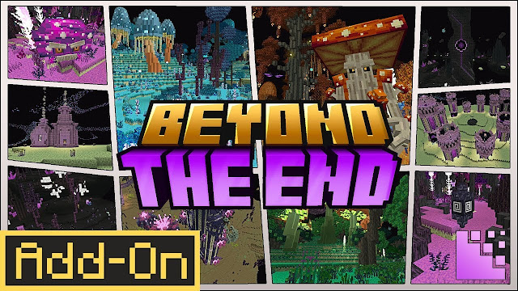
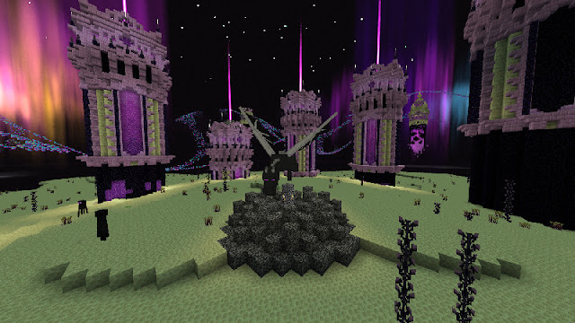
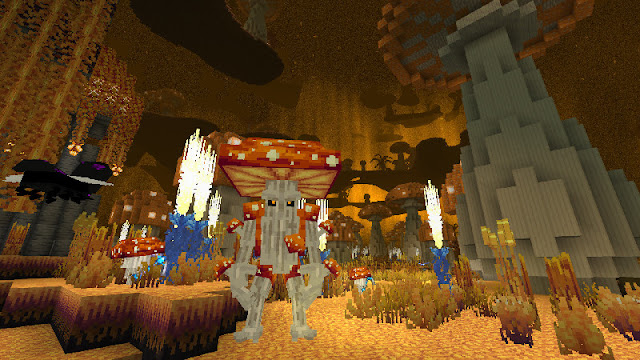
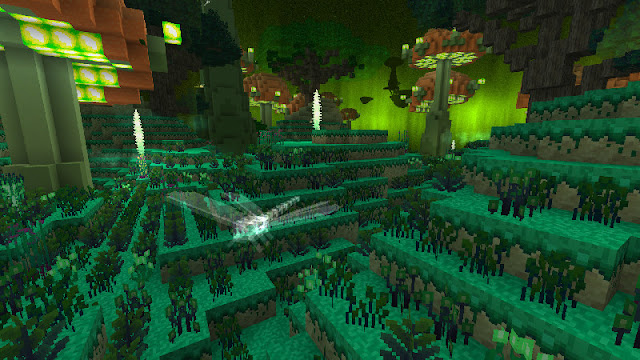
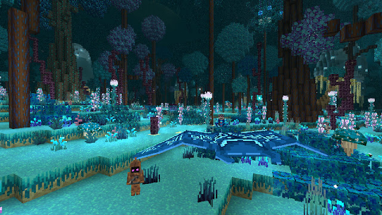

<h1>BEYOND THE END</h1>

Beyond the End', the Add-On that radically transforms the End in Minecraft:
+Discover 6 enchanting new biomes
+Explore a redesigned central island
+Encounter new mobs, and uncover new blocks and items
+Experience exclusive mechanics and features +Investigate new ores, weapons and armor

<h1>How it work?</h1>

By adding:

-new islands

-new biomes

-new blocks,ores,tools,and armors

<h1>Who Created Beyond The End?</h1>

NetherPixel

<h1>How many Version are in Beyond The End?</h1>

there are only 1 version

<ul>
<li>1.0</li>
</ul>
<h1>Does Beyond The End have Screenshot?</h1>

Yes here is 5 Screenshot

<h1>Where is the download?</h1>

here is the download

<a href="https://bedrock-hub.blogspot.com/2025/08/beyond-end.html?m=1" download>download</a>

Connect in whatsapp 896-8579-977 :3

If you wanna be friend in roblox then this the link :3

<a href="https://www.roblox.com/share?code=1db53eae1e69fe4780b57f19ae388f19&type=Profile&source=ProfileShare&stamp=1757743352086" download>Connect in roblox :3</a>
if you wanna subscribe us in youtube :3

<a href="https://youtube.com/@brutal_studio?feature=shared" download>subscribe on youtube:3</a>
If you wanna connect with us in telegram here the link:3

<a href="https://t.me/+jeNobnO7N2gzZGQ1"download>Join in telegram :3</a>
